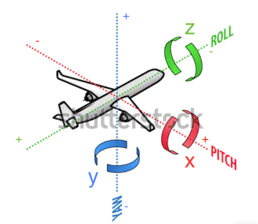

# Expressions of Angles of 3D space
Objects like the `encoder~` and the `rotator~` use 3D angles to place source or rotate the soundfield, respectively. 

3D angle protocols are always a huge source of confusion, because unfortunately they are not universal. Let me try to make this as clear as possible.

`gyro` supports 2 ways to express 3D angles. These are  
1. Quaternions  
2. Euler angles  

`gyro` also supports 6 possible rotation orders, aka, 6 different Euler Systems:  
1. xyz  
2. xzy  
3. yxz  
4. yzx  
5. zxy  
6. zyx  

Like jitter objects, `gyro` uses _yzx_ rotation order by default. You can set the rotation order with the `rotation_order` attribute. 

## Jit-style angle expressions

Outwardly, all `gyro` objects obey the same ordering standards as `jit` objects. This means that:  
1. Quaternions are ordered `x, y, z, w`  
2. Euler angles are ordered `xyz`, where the `x` direction is up-down (pitch), the `y` direction is side-side (yaw), and the `z` direction is tilt (roll). This picture (modifed from [here](https://www.shutterstock.com/image-vector/aviation-concept-axis-movement-three-dimensional-191329868)) communicates clearly how Euler angles work in Jitter.

Please note that jitter uses a **Right-Handed** coordinate System. Some VR headsets / headtracking use a **Left-Handed** coordinate system (eg apps made with Unity). If you want to use a Left-Handed Coordinated system with `gyro` objects, it is your responsibility to negate the necessary angles. Note that jitter also does not support left-handed coordinate systems. 

I recommend playing around with jitter helpfiles, such as `jit.euler2quat.maxhelp` to develop an intuition for the angles. 

Please note that the _Rotate Order_ attribute in the inspector for `jit` objects just controls the _order_ in which the rotations are performed, but does _not_ change the order in which the angles are expressed. 

If you are only using the externals, but not looking at any of the underlying code, then you don't need to worry about any of the below.  

## Resonance-style angle expressions
Inside the code, all angle protocols are converted to the way _Resonance_ does it, that is to say, the way the third-party library _Eigen_ does it. This means that:  
1. Quaternions are ordered `w, x, y, z`
2. Euler angle triples and the _x,y,z_ triple of the quaternion are ordered differently. Here is a mapping: 

	jit_triple[1] = Eigen_triple[2]  
	jit_triple[2] = Eigen_triple[3]  
	jit_triple[3] = Eigen_triple[1]  
 
	Eigen_triple[1] = jit_triple[3]  
	Eigen_triple[2] = jit_triple[1]  
	Eigen_triple[3] = jit_triple[2]   
	
You can read more about the intricacies of angle conversions in `gyro.rotator_tilde.cpp`. 
